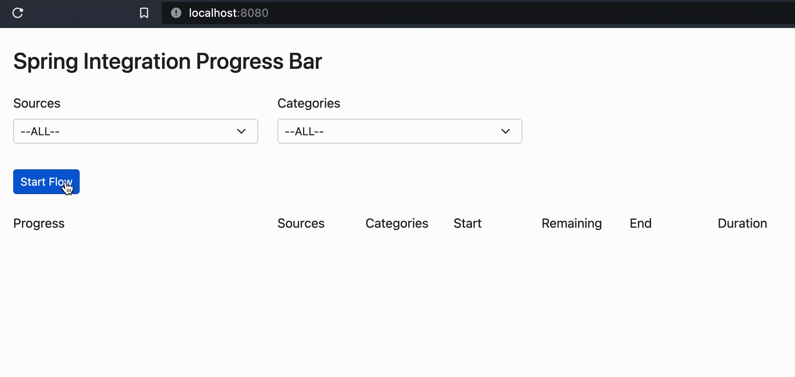

# spring-integration-progress-bar
A progress bar that can be controlled from a Spring Integration (Java DSL) Flow. The progress is communicated via WebSocket.

To see it work, run the Application and open http://localhost:8080/ in the browser.

Inspired by:
* https://github.com/joshlong/techtips/tree/master/examples/spring-integration-4.1-websockets-example
* https://github.com/johnpili/websocket-progress-bar
