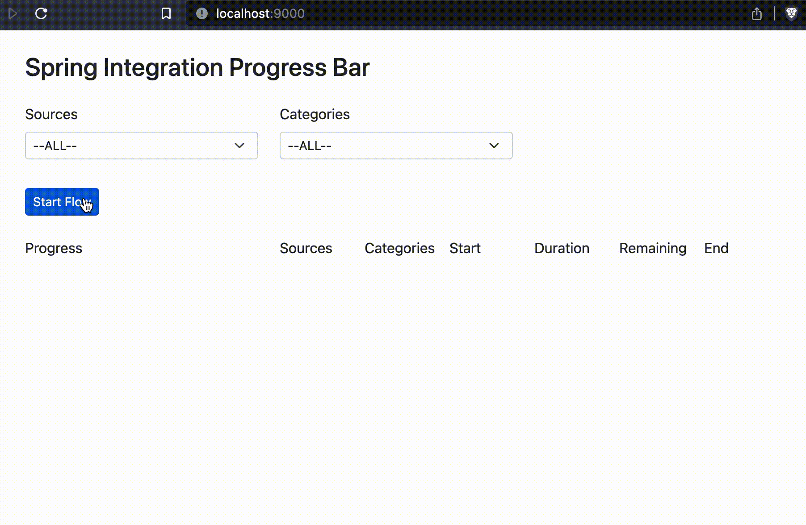

# spring-integration-progress-bar
A progress bar that can be controlled from a Spring Integration (Java DSL) Flow.  
The progress is communicated via WebSocket.  
Recovers from page-refreshes on currently running flows and also runs in parallel in multiple tabs

# Getting started

## Using Github Codespaces
If you use Github Codespaces, you already have all the necessary dependencies from the `.devcontainer/Dockerfile`.

## Installing the dependencies on your local machine
You can check the `.devcontainer/Dockerfile` and install the required dependencies manually. Many of them are only necessary for the Selenium Test to work.

## To get up and running quickly
- run `npm run build` to bundle the typescript code into `bundle.js`.
- run the Spring Boot `Application` in your favorite IDE.
  - If you are using Codespaces, open it inside VS Code instead of in the browser to start the application. 
- open the browser at http://localhost:8080

### Running the app with GitHub Codespaces inside the browser
For some reason, at the time of writing, The Java Plugin for Codespaces doesn't seem to work inside the browser. However, `mvn package` can run the java application just fine for the selenium test, and with the following instructions, you can get the app to run in the browser as well:
1. run `mvn package -DskipTests=true` to bundle tha app into a JAR file.
1. run the app with `java -jar target/spring-integration-progress-bar-0.0.1-SNAPSHOT.jar`
1. in the Terminal, click on the line that says `Open: http://localhost:8080` and you will be directed to a public URL in the browser that connects to the running app on GitHub. 
1. To get the WebSocket connection to work, you'll have to copy this public URL which is unique to your personal Codespaces container and add it inside `src/main/resources/application.yml` under `websocket.additional-allowed-origins`. Then start over at instruction `1.` to rebundle and start the application with this added websocket `allowed-origin` url.

## To develop using live-reloading through webpack
- run the Spring Boot `Application` in your favorite IDE, but set the Spring Profile to 'localhost'.
- run the `webpack-dev-server` with `npm run dev`
- open the browser at http://localhost:9000

## To run the Selenium SpringBootTest manually
- run `npm run build` to bundle the typescript code into `bundle.js`.
  - repeat this step after you change the typescript code. 
- run the `ProgressBarIT`.
- alternatively, you can run `mvn test` which does everything for you (see below).

## mvn test
Running `mvn test` will:
- install node and npm
- run `npm install`
- run `npm run build` which uses webpack to create `bundle.js` in the `resources` directory
- run `npm run test` to run the typescript unit tests
- run a Spring Boot Integration Test for the full application.

If you're running maven on your own machine, you can also run `mvn test -Dheadless=false` to open a browser for the Selenium test.

## Inspired by:
* https://github.com/joshlong/techtips/tree/master/examples/spring-integration-4.1-websockets-example
* https://github.com/johnpili/websocket-progress-bar
